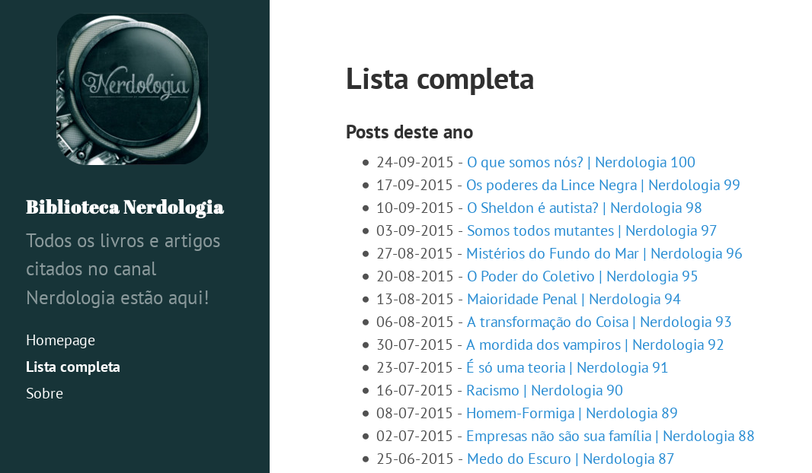

# Biblioteca Nerdologia 

Uma maneira rápida e fácil de encontrar todos os livros e artigos citados nos vídeos do [canal Nerdologia](http://www.youtube.com/nerdologia).

Aqui você encontrará links com:

- Lojas virtuais para comprar os livros 
- Sites dos autores 
- PDFs dos artigos citados

Acesse o site em [http://herodrigues.me/bibliotecanerdologia](http://herodrigues.me/bibliotecanerdologia).

_Este projeto utiliza o tema [Hyde](http://hyde.getpoole.com/)._

