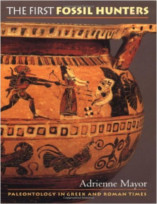

Preparem-se, aventureiros! Está na hora de explorarmos uma das criaturas mais importantes da mitologia do reino nerd: O DRAGÃO! Como o mito surgiu em tantas culturas diferentes? É possível mesmo que ele voasse? E a baforada de fogo é por causa de comida mexicana?

Livros
=====

**Título**: [The First Fossil Hunters: Paleontology in Greek and Roman Times](http://www.amazon.com/The-First-Fossil-Hunters-Paleontology/dp/0691058636) 
**Autor**: [Adrienne Mayor](web.stanford.edu/dept/HPS/Mayor.html)

Vídeo
=====

<iframe width="560" height="315" src="https://www.youtube.com/embed/eSGtN70TcJg" frameborder="0" allowfullscreen></iframe>

