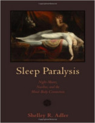

No episódio de hoje entenda o que é aquela sensação de que tem um monstro embaixo da sua cama, ou aquela presença que te impede de se mexe e, de quebra, descubra como o nosso cérebro tem o poder de nos assustar.

Livros
=====

**Título**: [Sleep Paralysis: Night-mares, Nocebos, and the Mind-Body Connection](http://www.amazon.com/Rabid-Cultural-History-Worlds-Diabolical/dp/0143123572) 
**Autor**: [Shelley R. Adle](http://www.osher.ucsf.edu/research/research-team/core-faculty/shelley-r-adler-phd/)

Artigos
=====

- Julia Santomauro and Christopher C. French. "[**Terror in the night**](http://thepsychologist.bps.org.uk/volume-22/edition-8/terror-night)". The British Psychology Society, Vol.22 (pp.672-675).

Vídeo
=====

<iframe width="560" height="315" src="https://www.youtube.com/embed/VZrQODHklJk" frameborder="0" allowfullscreen></iframe>

