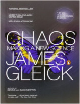

No episódio de hoje descubra como um simples bater de asas de uma borboleta pode fazer um belo de um estrago.

Livros
=====

**Título**: [Chaos: Making a New Science](http://www.amazon.com/gp/product/0143113453/ref=as_li_ss_tl?ie=UTF8&camp=1789&creative=390957&creativeASIN=0143113453&linkCode=as2&tag=rainhverme-20) 
**Autor**: [James Gleick](http://around.com/)

Vídeo
=====

<iframe width="560" height="315" src="https://www.youtube.com/embed/C4eHJ8ZJgG4" frameborder="0" allowfullscreen></iframe>

