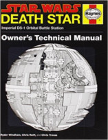

No episódio de hoje dá pra concluir que o Império Galáctico é realmente a facção mais rica e poderosa do universo! 

Livros
=====

**Título**: [Death Star Owner's Technical Manual: Star Wars: Imperial DS-1 Orbital Battle Station](http://www.amazon.com/gp/product/0804176612/ref=as_li_ss_tl?ie=UTF8&camp=1789&creative=390957&creativeASIN=0804176612&linkCode=as2&tag=rainhverme-20) 
**Autor**: [Ryder Windham](http://starwars.wikia.com/wiki/Ryder_Windham) e [Chris Reiff](http://www.chrisreiff.com/) e [Chris Trevas](http:/www.christrevas.com/)

Artigos
=====

- David Boulderstone, Calum Meredith, Simon Clapton. "[**A2_8 That’s No Moon**](https://physics.le.ac.uk/journals/index.php/pst/article/view/328/195%20Wookieepedia:%20http:/starwars.wikia.com/wiki/Death_Star)". Journal of Physics Special Topics, Volume 9, no. 1 (2010).

Vídeo
=====

<iframe width="560" height="315" src="https://www.youtube.com/embed/fXCL3jzM1js" frameborder="0" allowfullscreen></iframe>

