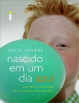

No Nerdologia de hoje entenda porque choramos em filmes, nos retorcemos ao ver vídeos de pessoas se machucando e porque às vezes relacionamos uma emoção à sensações, como achar um comentário "azedo".

Livros
=====

**Título**: [Nascido em um Dia Azul](http://www.livrariacultura.com.br/p/nascido-em-um-dia-azul-3223020) 
**Autor**: [Daniel Tammet](http://www.danieltammet.net/)

Artigos
=====

- Jody Osborn, Stuart W.G. Derbyshire. "[**Pain sensation evoked by observing injury in others**](http://www.sciencedirect.com.sci-hub.org/science/article/pii/S0304395909006678)". Volume 148, Issue 2, February 2010, Pages 268–274.

- Giacomo Rizzolatti and Laila Craighero. "[**Mirror-touch synesthesia is linked with empathy**](http://www.daysyn.com/Banissy_Wardpublished.pdf)".

- Bramble, D. and Lieberman, D., Raichlen, D., Pontzer, H. and Cutright-Smith, E. "[**The Mirror-Neuron System**](http://www.kuleuven.be/mirrorneuronsystem/readinglist/Rizzolatti%20&%20Craighero%202004%20-%20The%20MNS%20-%20ARN.pdf)". The Journal of Experimental Biology 209, 2143-2155.

- Olympia Colizoli, Jaap M. J. Murre, and Romke Rouw. "[**A taste for words and sounds: a case of lexical-gustatory and sound-gustatory synesthesia**](http://www.ncbi.nlm.nih.gov/pmc/articles/PMC3806228/)". Front Psychol. 2013; 4: 775. 

Vídeo
=====

<iframe width="560" height="315" src="https://www.youtube.com/embed/XINJpXE4eqM" frameborder="0" allowfullscreen></iframe>

