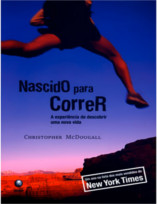

No episódio de hoje corra e clique no "play" para saber por que a nossa evolução nos deu nádegas proeminentes! 

Livros
=====

**Título**: [Nascido Para Correr - a Experiência de Descobrir Uma Nova Vida](http://www.saraiva.com.br/nascido-para-correr-a-experiencia-de-descobrir-uma-nova-vida-2884867.html) 
**Autor**: [Christopher Mcdougall](http://www.chrismcdougall.com/)

Artigos
=====

- Bramble, D. and Lieberman, D. "[**Endurance running and the evolution of Homo**](http://www.fas.harvard.edu/~skeleton/pdfs/2004e.pdf)". Harvard University.

- Bramble, D. and Lieberman, D. "[**The Evolution of Marathon Running: Capabilities in Humans**](http://dash.harvard.edu/bitstream/handle/1/3716644/Lieberman_Marathon.pdf?sequence=3)". Harvard University.

- Bramble, D. and Lieberman, D., Raichlen, D., Pontzer, H. and Cutright-Smith, E. "[**The human gluteus maximus and its role in running**](http://pages.nycep.org/pontzer/Papers/LiebermanEtAl2006JEB_HumanGluteusMaximusRoleRunning.pdf)". The Journal of Experimental Biology 209, 2143-2155.

- Ridge, S., Johnson, A., Mitchell, U., Hunter, I., Robinson, E., Rich, B.and Brown, S. "[**Foot Bone Marrow Edema after 10-Week Transition of Minimalist Running Shoes**](http://unique-sportstime.de/site/wp-content/uploads/Barfuss-Laufen1.pdf)". Journal of the American College of Sports Medicine.

Vídeo
=====

<iframe width="560" height="315" src="https://www.youtube.com/embed/nHlRz0b-9LY" frameborder="0" allowfullscreen></iframe>

