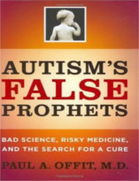

Bem vindos a mais um Nerdologia! Existe algum perigo nas vacinas? No programa de hoje vamos responder essa perigosa dúvida!

Livros
=====

**Título**: [The Panic Virus: The True Story Behind the Vaccine-Autism Controversy](http://www.amazon.com/The-Panic-Virus-Vaccine-Autism-Controversy/dp/1439158657) 
**Autor**: [Seth Mnookin](http://sethmnookin.com/)

**Título**: [Autism's False Prophets: Bad Science, Risky Medicine, and the Search for a Cure](http://www.amazon.com/Autisms-False-Prophets-Science-Medicine/dp/023114637X) 
**Autor**: [Paul A. Offit](http://paul-offit.com/)

Artigos
=====

- Morales-Aizpurúa, Isabel C., Alfredo Tenuta-Filho, Alice M. Sakuma, and Odair Zenebon. "[**Mercúrio total em cação comercializado em São Paulo-SP, Brasil**](http://www.scielo.br/scielo.php?script=sci_arttext&pid=S0101-20611999000300024&lng=pt&nrm=iso&tlng=pt)". Ciência e Tecnologia de Alimentos 19, no. 3 (1999): 429-432.

- Dias, Adriana CL, Jean RD Guimarães, and Olaf Malm. "[**Mercúrio total em músculo de cação Prionace glauca (Linnaeus, 1758) e de espadarte Xiphias gladius Linnaeus, 1758, na costa sul-sudeste do Brasil e suas implicações para a saúde pública**](http://www.scielo.br/pdf/csp/v24n9/12.pdf)". Cad Saúde Pública 24 (2008): 2063-70. 

- Offit, Paul A., and Rita K. Jew. "[**Addressing parents' concerns: do vaccines contain harmful preservatives, adjuvants, additives, or residuals?**](http://pediatrics.aappublications.org/content/112/6/1394.full.pdf+html)". Pediatrics 112, no. 6 (2003): 1394-1397

Vídeo
=====

<iframe width="560" height="315" src="https://www.youtube.com/embed/MiIZlSNAu0E" frameborder="0" allowfullscreen></iframe>

