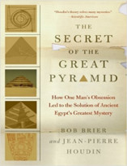
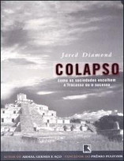

Bem vindos a mais um Nerdologia! Hoje vamos entender como foi possível a construção das pirâmides!

Livros
=====

**Título**: [The Secret of the Great Pyramid: How One Man's Obsession Led to the Solution of Ancient Egypt's Greatest Mystery ](http://www.amazon.com/The-Secret-Great-Pyramid-Obsession/dp/0061655538) 
**Autores**: [Bob Brier](http://drbobbrier.com/) e [Jean-Pierre Houdin](https://en.wikipedia.org/wiki/Jean-Pierre_Houdin)

**Título**: [Colapso - Como as Sociedades Escolhem o Fracasso ou o Sucesso ](http://www.saraiva.com.br/colapso-como-as-sociedades-escolhem-o-fracasso-ou-o-sucesso-183317.html) 
**Autores**: [Jared Diamond](http://www.jareddiamond.org/)

Vídeo
=====

<iframe width="560" height="315" src="https://www.youtube.com/embed/q7zyyX7PK9E" frameborder="0" allowfullscreen></iframe>

