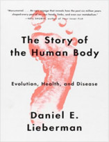

Neste Nerdologia, você vai ver todas as vantagens de se ter um dedão opositor, desde pegar pedras até digitar mensagens no celular.

Livros
=====

**Título**: [The Story of the Human Body: Evolution, Health, and Disease](http://www.amazon.com/The-Story-Human-Body-Evolution/dp/030774180X) 
**Autor**: [Daniel Lieberman](http://https://www.fas.harvard.edu/~skeleton/danlhome.html)

Artigos
=====

- Yasuoka, Koichi, and Motoko Yasuoka. "[**On the Prehistory of QWERTY**](http://repository.kulib.kyoto-u.ac.jp/dspace/bitstream/2433/139379/1/42_161.pdf)". Zinbun 42 (2011): 161-174. 

- Young, Richard W. "[**Evolution of the human hand: the role of throwing and clubbing**](http://www.ncbi.nlm.nih.gov/pmc/articles/PMC1571064/)". Journal of Anatomy 202, no. 1 (2003): 165-174.

- Roach, Neil T., Madhusudhan Venkadesan, Michael J. Rainbow, and Daniel E. Lieberman. "[**Elastic energy storage in the shoulder and the evolution of high-speed throwing in Homo**](http://www.people.fas.harvard.edu/~skeleton/pdfs/2013b.pdf)". Nature 498, no. 7455 (2013): 483-486. 

- Morgan, Michael H., and David R. Carrier. "[**Protective buttressing of the human fist and the evolution of hominin hands**](http://jeb.biologists.org/content/216/2/236.full.pdf)". The Journal of experimental biology 216, no. 2 (2013): 236-244.

Vídeo
=====

<iframe width="560" height="315" src="https://www.youtube.com/embed/57M7YjkDFbs" frameborder="0" allowfullscreen></iframe>

