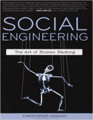

Neste episódio do Nerdologia falamos sobre a memória.

Livros
=====

**Título**: [Social Engineering: The Art of Human Hacking](http://www.amazon.com/Social-Engineering-The-Human-Hacking/dp/0470639539) 
**Autor**: [Christopher Hadnagy](https://en.wikipedia.org/wiki/Christopher_Hadnagy)

Vídeo
=====

<iframe width="560" height="315" src="https://www.youtube.com/embed/3crSCPw7ofk" frameborder="0" allowfullscreen></iframe>

