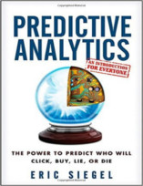

Neste episódio do Nerdologia você vai entender o que é a Big Data e descobrir como ela pode até "prever o futuro".

Livros
=====

**Título**: [Predictive Analytics: The Power to Predict Who Will Click, Buy, Lie, Or Die](http://www.amazon.com/Predictive-Analytics-Power-Predict-Click/dp/1118356853) 
**Autor**: [Eric Siegel](http://www.cs.columbia.edu/~evs/)

Artigos
=====

- Bollen, Johan, Huina Mao, and Xiaojun Zeng. "[**Twitter mood predicts the stock market**](http://arxiv.org/pdf/1010.3003.pdf%3Fiframe=true&width=90%2525&height=90%2525&sa=X&scisig=AAGBfm2dF-QKobX1fGBnO9rUIPMzX3IhmQ&oi=scholarr&ei=d8HAUqCWNo2p7AaP3oD4BQ&ved=0CCwQgAMoADAA)". Journal of Computational Science 2, no. 1 (2011): 1-8.

Vídeo
=====

<iframe width="560" height="315" src="https://www.youtube.com/embed/hEFFCKxYbKM" frameborder="0" allowfullscreen></iframe>

