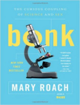
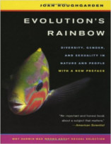

Promessa é dívida, hoje o Nerdologia será sobre um dos temas mais pedidos. Vamos falar tudo e não esconder nada sobre: AQUILO. Mundial.

Livros
=====

**Título**: [Bonk: The Curious Coupling of Science and Sex](http://www.amazon.com/Bonk-The-Curious-Coupling-Science/dp/0393334791) 
**Autor**: [Mary Roach](http://www.maryroach.net/)

**Título**: [Evolution's Rainbow: Diversity, Gender, and Sexuality in Nature and People](http://www.amazon.com/Evolutions-Rainbow-Diversity-Gender-Sexuality/dp/0520260120) 
**Autor**: [Joan Roughgarden](http://web.stanford.edu/people/Joan.Roughgarden/)

Artigos
=====

- Young, Lindsay C., Brenda J. Zaun, and Eric A. VanderWerf. "[**Successful same-sex pairing in Laysan albatross**](http://rsbl.royalsocietypublishing.org/content/roybiolett/4/4/323.full.pdf)". Biology Letters 4, no. 4 (2008): 323-325.

- Sommer, Volker, and Paul L. Vasey, eds. "[**Homosexual behaviour in animals: an evolutionary perspective**](http://www.cambridge.org/zw/academic/subjects/life-sciences/animal-behaviour/homosexual-behaviour-animals-evolutionary-perspective)". Cambridge University Press, 2006.

Vídeo
=====

<iframe width="560" height="315" src="https://www.youtube.com/embed/vWj1pBAzbpU" frameborder="0" allowfullscreen></iframe>

