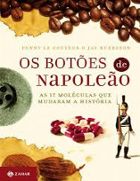
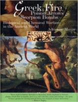
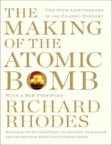

Neste episódio do Nerdologia vamos entender como a ciência foi usada para criar armas mortais, que fizeram parte da história, como na 1ª Guerra Mundial.

Livros
=====

**Título**: [Os Botões de Napoleão: As 17 Moléculas que Mudaram a História](http://www.saraiva.com.br/os-botoes-de-napoleao-as-17-moleculas-que-mudaram-a-historia-1392851.html) 
**Autores**: [Jen Burreson](http://www.penguin.com/author/jay-burreson/242370) e [Penny Le Couteur](http://www.zahar.com.br/autor/penny-le-couteur)

**Título**: [Greek Fire, Poison Arrows & Scorpion Bombs: Biological and Chemical Warfare in the Ancient World](http://www.amazon.com/gp/product/158567348X/ref=as_li_tl?ie=UTF8&camp=1789&creative=390957&creativeASIN=158567348X&linkCode=as2&tag=rainhverme-20&linkId=NWR32FTEATQVWFL5) 
**Autor**: [Adrienne Mayor](http://web.stanford.edu/dept/HPS/Mayor.html)

**Título**: [Making of the Atomic Bomb](http://www.amazon.com/gp/product/B008TRU7SQ/ref=as_li_tl?ie=UTF8&camp=1789&creative=390957&creativeASIN=B008TRU7SQ&linkCode=as2&tag=rainhverme-20&linkId=VKHS2RMZL4JLIZVU) 
**Autor**: [Richard Rhodes](http://www.richardrhodes.com/)

Vídeo
=====

<iframe width="560" height="315" src="https://www.youtube.com/embed/2jiWgsuLp8w" frameborder="0" allowfullscreen></iframe>

