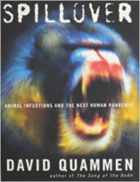

Neste episódio do Nerdologia vamos ensinar como sobreviver ao temível Ebola!

Livros
=====

**Título**: [Zona Quente](http://www.livrariacultura.com.br/p/zona-quente-328319) 
**Autor**: [Richard Preston](http://richardpreston.net/)

**Título**: [A Próxima Peste](http://www.livrariacultura.com.br/p/a-proxima-peste-56421) 
**Autor**: [Laurie Garret](http://lauriegarrett.com/)

**Título**: [Spillover: Animal Infections and the Next Human Pandemic](http://www.amazon.com/Spillover-Animal-Infections-Human-Pandemic/dp/0393066800) 
**Autor**: [David Quammen](http://www.davidquammen.com/)

Artigos
=====

- Olival, Kevin J., and David TS Hayman. "[**Filoviruses in bats: current knowledge and future directions**](http://www.biomedsearch.com/attachments/00/24/74/77/24747773/viruses-06-01759.pdf)". Viruses 6, no. 4 (2014): 1759-1788.

- Carroll, Serena A., Jonathan S. Towner, Tara K. Sealy, Laura K. McMullan, Marina L. Khristova, Felicity J. Burt, Robert Swanepoel, Pierre E. Rollin, and Stuart T. Nichol. "[**Molecular evolution of viruses of the family Filoviridae based on 97 whole-genome sequences**](http://jvi.asm.org/content/87/5/2608.full.pdf)". Journal of virology 87, no. 5 (2013): 2608-2616. http://goo.gl/0zN12P

- Baize, Sylvain, Delphine Pannetier, Lisa Oestereich, Toni Rieger, Lamine Koivogui, N'Faly Magassouba, Barrè Soropogui et al. "[**Emergence of Zaire Ebola virus disease in Guinea—preliminary report**](http://www.msf.org/sites/msf.org/files/emergence_of_zaire_ebola_virus_disease_in_guinea_-_preliminary_report.pdf)". New England Journal of Medicine (2014). http://goo.gl/JYSNhD

Vídeo
=====

<iframe width="560" height="315" src="https://www.youtube.com/embed/roC9qqxJCo0" frameborder="0" allowfullscreen></iframe>
