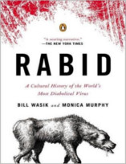

Neste episódio do Nerdologia vamos conhecer a inspiração para o fungo manipulador de The Last of Us

Livros
=====

**Título**: [Rabid: A Cultural History of the World's Most Diabolical Virus](http://www.amazon.com/Rabid-Cultural-History-Worlds-Diabolical/dp/0143123572) 
**Autor**: [Bill Wasik](http://billwasik.com/) e [Monica Murphy](http://monicamurphyauthor.com/)

Vídeo
=====

<iframe width="560" height="315" src="https://www.youtube.com/embed/ThG5RHBR7dA" frameborder="0" allowfullscreen></iframe>

