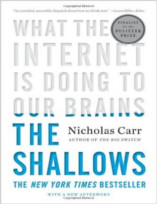
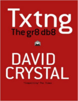

Neste episódio vamos responder a pergunta: "Será que estamos mais burros?". Será que a internet, a facilidade de encontrar informações e os smartphones estão afetando a nossa capacidade de apreender?

Livros
=====

**Título**: [The Shallows: What the Internet Is Doing to Our Brains](http://www.amazon.com/The-Shallows-Internet-Doing-Brains/dp/0393339750) 
**Autor**: [Nicholas G. Carr](http://www.nicholascarr.com/)

**Título**: [Txtng: The Gr8 Db8](http://www.barnesandnoble.com/w/txtng-david-crystal/1103373807?ean=9780199571338) 
**Autor**: [David Crystal](http://www.davidcrystal.com/)

**Título**: [ Smarter Than You Think: How Technology Is Changing Our Minds for the Better](http://www.livrariacultura.com.br/p/smarter-than-you-think-how-technology-is-84380186?id_link=8787&adtype=pla&gclid=CjwKEAjwyqOwBRDZuIO4p5SV8w0SJAAQoUSwQdazSOAB6SJQMKkkAZw5Djsw5A2lKgYDm2SEb6J2WBoCAtrw_wcB) 
**Autor**: [Clive Thompson](http://smarterthanyouthink.net/bio/)

Artigos
=====

-  Andy Clark & David J. Chalmers. "[**The Extended Mind**](http://consc.net/papers/extended.html)".

Vídeo
=====

<iframe width="560" height="315" src="https://www.youtube.com/embed/nW-Mqe9Tgjc" frameborder="0" allowfullscreen></iframe>

