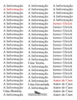
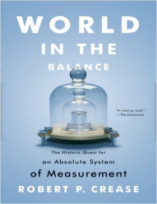

Neste episódio vamos entender o motivo de existirem variações na forma de medir as coisas. E também como são definidos os valores de medição que estamos acostumados a usar.

Livros
=====

**Título**: [A Informação](http://www.submarino.com.br/produto/113685069/livro-a-informacao?opn=JOVEMNERD&epar=jovemnerd&WT.mc_id=afiliados_jovemnerd&WT.mc_ev=Click) 
**Autor**: [James Gleick](https://www.around.com/)

**Título**: [World in the Balance](http://www.saraiva.com.br/o-instinto-da-linguagem-como-a-mente-cria-a-linguagem-105311.html) 
**Autor**: [Robert P. Crease](https://www.robertpcrease.com/)

Vídeo
=====

<iframe width="560" height="315" src="https://www.youtube.com/embed/MeEGw_O7c8E" frameborder="0" allowfullscreen></iframe>

