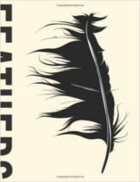

Neste episódio vamos mostrar onde os filmes da série Jurassic Park acertaram e erraram!

Livros
=====

**Título**: [Feathers: The Evolution of a Natural Miracle](http://www.amazon.com/Feathers-The-Evolution-Natural-Miracle/dp/0465028780) 
**Autor**: [Thor Hanson](http://www.thorhanson.net/)

Artigos
=====

- Morten E. Allentoft, Matthew Collins, David Harker, James Haile, Charlotte L. Oskam, Marie L. Hale, Paula F. Campos, Jose A. Samaniego, M. Thomas P. Gilbert, Eske Willerslev, Guojie Zhang, R. Paul Scofield, Richard N. Holdaway, Michael Bunce. "[**The half-life of DNA in bone: measuring decay kinetics in 158 dated fossils**](http://rspb.royalsocietypublishing.org/content/royprsb/279/1748/4724.full.pdf)". Proceedings of the Royal Society Publishing, Volume 279, Issue 1748.

Vídeo
=====

<iframe width="560" height="315" src="https://www.youtube.com/embed/I4_L5y6GU-w" frameborder="0" allowfullscreen></iframe>

