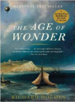

Neste episódio vamos explicar as diferenças entre Astrologia e Astronomia! 

Livros
=====

**Título**: [The Age of Wonder](http://www.amazon.com/The-Age-Wonder-Generation-Discovery/dp/1400031877) 
**Autor**: [Richard Holmes](literature.britishcouncil.org/richard-holmes)

Artigos
=====

- Carlson, Shawn. "[**A double-blind test of astrology**](http://muller.lbl.gov/papers/Astrology-Carlson.pdf)" Nature (1985/12/05), Volume 318, Issue 6045.

Vídeo
=====

<iframe width="560" height="315" src="https://www.youtube.com/embed/SMureUD4h_c" frameborder="0" allowfullscreen></iframe>

