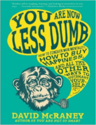

Neste programa vamos entrar no mundo dos fanboys e entender o que faz ele odiar ou amar algo com todas as suas forças.

Livros
=====

**Título**: [O Que nos Faz Felizes](http://www.livrariacultura.com.br/p/o-que-nos-faz-felizes-1414900) 
**Autor**: [Dan Gilbert](http://www.danielgilbert.com/)

**Título**: [You Are Now Less Dumb](http://www.amazon.com/You-Are-Now-Less-Dumb/dp/1592408796) 
**Autor**: [David McRaney](http://davidmcraney.com/)

Artigos
=====

- Landy, David, e Harold Sigall. "[**Beauty is talent: Task evaluation as a function of the performer's physical attractiveness**](http://doi.apa.org/journals/psp/29/3/299.pdf) Journal of Personality and Social Psychology, Vol 29(3), (1974), 299-304.

- Sigall, Harold, e Nancy Ostrove. "[**Beautiful but dangerous: Effects of offender attractiveness and nature of the crime on juridic judgment**](http://www.communicationcache.com/uploads/1/0/8/8/10887248/beautiful_but_dangerous-_effects_of_offender_attractiveness_and_nature_of_the_crime_on_juridic_judgment.pdf)" Journal of Personality and Social Psychology 31, no. 3 (1975): 410.

- Egan, Louisa C., Laurie R. Santos, and Paul Bloom. "[**The origins of cognitive dissonance evidence from children and monkeys**](http://www.brynmawr.edu/psychology/documents/EganSantosandBloom2007.pdf)" Psychological science 18, no. 11 (2007): 978-983.

- Hepler, Justin, and Dolores Albarracín. "[**Attitudes without objects: Evidence for a dispositional attitude, its measurement, and its consequences**](http://psycnet.apa.org/index.cfm?fa=buy.optionToBuy&id=2013-13270-001)" Journal of personality and social psychology 104, no. 6 (2013): 1060.

Vídeo
=====

<iframe width="560" height="315" src="https://www.youtube.com/embed/Pr6z7ZM1ESQ" frameborder="0" allowfullscreen></iframe>

