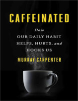
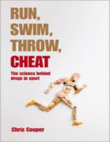

Neste programa explicamos o que acontece com o corpo humano dopado!

Livros
=====

**Título**: [Caffeinated: How Our Daily Habit Helps, Hurts, and Hooks Us](http://www.amazon.com/Caffeinated-Daily-Habit-Helps-Hurts/dp/1594631387) 
**Autor**: [Murray Carpenter](https://www.chriscooperonline.com/) 

**Título**: [Run, Swim, Throw, Cheat: The Science Behind Drugs in Sport](http://www.amazon.com/Run-Swim-Throw-Cheat-science/dp/0199678782) 
**Autor**: [Murray Carpenter](https://murraycarpenter.com/) 

Artigos
=====

- Rudman, Daniel et al., [**Effects of Human Growth Hormone in Men over 60 Years Old**](http://www.nejm.org/doi/pdf/10.1056/NEJM199007053230101) New England Journal of Medicine, Volume 323, 1-6.

- Gerber, Peter A et al., "[**The dire consequences of doping**](http://www.thelancet.com/pdfs/journals/lancet/PIIS0140-6736%2808%2961278-7.pdf)" The Lancet, Volume 372, Issue 9639, 656.

- Jelkmann, Wolfgang, "[**Erythropoietin after a century of research: younger than ever**](https://eclass.duth.gr/modules/document/file.php/ALEX01206/%CE%A6%CF%81%CE%BF%CE%BD%CF%84%CE%B9%CF%83%CF%84%CE%AE%CF%81%CE%B9%CE%BF/%CE%98%CE%AD%CE%BC%CE%B1%CF%84%CE%B1/8.pdf)" Current Anthropology 47, no. 3 (June 1, 2006): 513-520. 

Vídeo
=====

<iframe width="560" height="315" src="https://www.youtube.com/embed/QN8nP0w_Hvo" frameborder="0" allowfullscreen></iframe>

