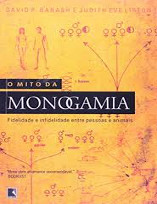

Esperamos que você não esteja vendo outros programas sobre ciência… porque no Nerdologia de hoje vamos tentar responder a pergunta: “A traição é algo natural?”

Livros
=====

**Título**: [O Mito da Monogamia](http://www.livrariacultura.com.br/p/o-mito-da-monogamia-2195871) 
**Autores**: [Judith P. Lipton](https://www.bucknell.edu/x16820.xml) e [David Barash](http://www.psych.uw.edu/psych.php?p=358&PersonID=7)

Artigos
=====

- Bellis, M., K. Hughes, S. Hughes, and J. Ashton. "[**Measuring paternal discrepancy and its public health consequences**](http://www.ncbi.nlm.nih.gov/pmc/articles/PMC1733152/pdf/v059p00749.pdf)" Journal of Epidemiology and Community Health 59, no. 9 (September 2005): 749-754.

- Anderson, Kermyt G. "[**How Well Does Paternity Confidence Match Actual Paternity? Evidence from Worldwide Nonpaternity Rates**](http://www.anth.uconn.edu/degree_programs/ecolevo/kermyt.pdf)" Current Anthropology 47, no. 3 (June 1, 2006): 513-520. 

Vídeo
=====

<iframe width="560" height="315" src="https://www.youtube.com/embed/IVHW4wx6R9A" frameborder="0" allowfullscreen></iframe>

