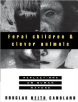
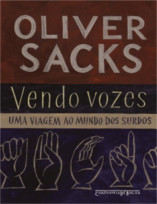

E no Nerdologia de hoje, vamos analisar a lenda de Tarzan, será que uma criança criada por animais selvagens e isolada de qualquer contato com outros seres humanos poderia mais tarde viver em sociedade?

Livros
=====

**Título**: [Feral Children and Clever Animals: Reflections on Human Nature](http://www.amazon.com/Feral-Children-Clever-Animals-Reflections/dp/0195102843) 
**Autor**: [Douglas K. Candland](https://www.bucknell.edu/x16820.xml)

**Título**: [O Instinto da Linguagem: Como a Mente Cria a Linguagem](http://www.saraiva.com.br/o-instinto-da-linguagem-como-a-mente-cria-a-linguagem-105311.html) 
**Autor**: [Steven Pinker](https://stevenpinker.com/)

**Título**: [Vendo Vozes](http://www.livrariacultura.com.br/p/vendo-vozes-livro-de-bolso-22052391) 
**Autor**: [Oliver Sacks](https://www.oliversacks.com)

Vídeo
=====

<iframe width="560" height="315" src="https://www.youtube.com/embed/kKKW6RlQygM" frameborder="0" allowfullscreen></iframe>

