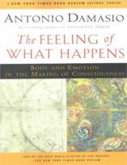

E no Nerdologia de hoje, explicamos por que as emoções são importantes para o desenvolvimento do ser humano.

Livros
=====

**Título**: [The Feeling of What Happens](http://www.amazon.com/The-Feeling-What-Happens-Consciousness/dp/0156010755) 
**Autor**: [Antonio Damasio](https://dornsife.usc.edu/cf/faculty-and-staff/faculty.cfm?pid=1008328)

Vídeo
=====

<iframe width="560" height="315" src="https://www.youtube.com/embed/PO7GZ1DsPpo" frameborder="0" allowfullscreen></iframe>

