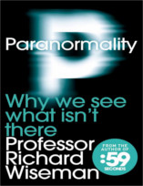

Neste episódio do Nerdologia giramos o compasso e ouvimos as batidas na mesa para falar sobre a BRINCADEIRA DO COPO!

Livros
=====

**Título**: [Paranormality: Why We See what Isn't There](http://www.saraiva.com.br/os-anjos-bons-da-nossa-natureza-por-que-a-violencia-diminuiu-4891101.html?PAC_ID=123134&gclid=CjwKEAjwyqOwBRDZuIO4p5SV8w0SJAAQoUSwbtTHGwtiuPH0GvYz1ugdTe_1I1fyiSV3cmF7bhnBkRoC1tHw_wcB&) 
**Autor**: [Richard Wiseman](http://www.richardwiseman.com)

Artigos
=====

- Wegner, Daniel M., David J. Schneider, Samuel R. Carter, and Teri L. White. "[**Paradoxical effects of thought suppression**](http://citeseerx.ist.psu.edu/viewdoc/download?doi=10.1.1.405.2294&rep=rep1&type=pdf)" Journal of personality and social psychology 53, no. 1 (1987): 5.

- Wegner, Daniel M., Matthew Ansfield, and Daniel Pilloff. "[**The putt and the pendulum: Ironic effects of the mental control of action**](http://www.castonline.ilstu.edu/smith/405/readings_pdf/anxiety_rdngs/wegner%20putt%20pendulum.pdf)" Psychological Science 9, no. 3 (1998): 196-199.

Vídeo
=====

<iframe width="560" height="315" src="https://www.youtube.com/embed/d5qMnDUyS3s" frameborder="0" allowfullscreen></iframe>

