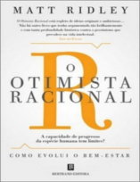

Neste episódio do Nerdologia discutimos por que o mundo está se tornando mais sensível às coisas.

Livros
=====

**Título**: [Os Anjos Bons Da Nossa Natureza](http://www.saraiva.com.br/os-anjos-bons-da-nossa-natureza-por-que-a-violencia-diminuiu-4891101.html?PAC_ID=123134&gclid=CjwKEAjwyqOwBRDZuIO4p5SV8w0SJAAQoUSwbtTHGwtiuPH0GvYz1ugdTe_1I1fyiSV3cmF7bhnBkRoC1tHw_wcB&) 
**Autor**: [Steven Pinker](http://stevenpinker.com/)

**Título**: [O Otimista Racional](http://www.saraiva.com.br/o-otimista-racional-por-que-o-mundo-melhora-7276787.html) 
**Autor**: [Matt Ridley](http://www.mattridley.co.uk/)

**Título**: [Pense no garfo!](http://www.livrariacultura.com.br/p/pense-no-garfo-42268107) 
**Autor**: [Bee Wilson](http://www.considerthefork.com/)

**Título**: [Rápido e Devagar, Duas formas de pensar](http://www.saraiva.com.br/rapido-e-devagar-duas-formas-de-pensar-4074748.html) 
**Autor**: [Daniel Kahneman](http://www.princeton.edu/~kahneman/)

Vídeo
=====

<iframe width="560" height="315" src="https://www.youtube.com/embed/A-jIUPEqYdw" frameborder="0" allowfullscreen></iframe>

