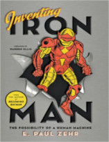

Neste episódio do Nerdologia tentamos entender como a armadura do Homem de Ferro funciona e será que já temos a tecnologia para construir uma?

Artigos
=====

- Turner, G. Grey. "[**A bullet in the heart for twenty-three years**](http://www.sciencedirect.com.sci-hub.org/science/article/pii/S0140673600914120)" The Lancet 236, no. 6112 (1940): 487-489.

Livros
=====

**Título**: [Inventing Iron Man](http://www.barnesandnoble.com/w/inventing-iron-man-e-paul-zehr/1100719991?ean=9781421402260) 
**Autor**: [Paul Zehr](http://www.zehr.ca/)

Vídeo
=====

<iframe width="560" height="315" src="https://www.youtube.com/embed/jB3EFK_vAuo" frameborder="0" allowfullscreen></iframe>

