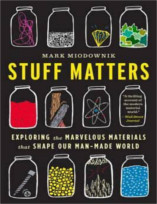

Neste episódio do Nerdologia colocamos o uniforme azul, vermelho e branco para entender como funciona a arma principal do bandeiroso!

Livros
=====

**Título**: [Stuff Matters: Exploring the Marvelous Materials That Shape Our Man-Made World](http://www.livrariacultura.com.br/p/stuff-matters-82697615?id_link=8787&adtype=pla&gclid=CjwKEAjwyqOwBRDZuIO4p5SV8w0SJAAQoUSwpjoH4YsEeW7fZmrqo3RkopCZQIGlgk3UQUmNb2kIcxoCLVDw_wcB) 
**Autor**: [Mark Miodownik](http://www.markmiodownik.net/)

Vídeo
=====

<iframe width="560" height="315" src="https://www.youtube.com/embed/dYKa5cgRMkg" frameborder="0" allowfullscreen></iframe>

