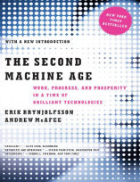
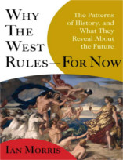
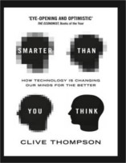
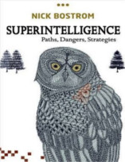

Neste episódio do Nerdologia nos livramos dos cordames para falar sobre Inteligência Artificial, será que estamos próximos de criar máquinas que pensem como Ultron ou a Skynet?

Livros
=====

**Título**: [The Second Machine Age](http://www.livrariacultura.com.br/p/second-machine-age-work-progress-and-81716212) 
**Autores**: [Andrew McAfee](http://andrewmcafee.org/blog/) e [Erik Brynjolfsson](http://ebusiness.mit.edu/erik/)

**Título**: [Why the West Rules - For Now](http://www.livrariacultura.com.br/p/why-the-west-rules-for-now-84264763?id_link=8787&adtype=pla&gclid=CjwKEAjwyqOwBRDZuIO4p5SV8w0SJAAQoUSwWKMgORtIdc0usgjvwZtocNLqLwJGMCLFZ-aNBNEIRhoCePXw_wcB) 
**Autor**: [Ian Morris](http://www.ianmorris.org/)

**Título**: [ Smarter Than You Think: How Technology Is Changing Our Minds for the Better](http://www.livrariacultura.com.br/p/smarter-than-you-think-how-technology-is-84380186?id_link=8787&adtype=pla&gclid=CjwKEAjwyqOwBRDZuIO4p5SV8w0SJAAQoUSwQdazSOAB6SJQMKkkAZw5Djsw5A2lKgYDm2SEb6J2WBoCAtrw_wcB) 
**Autor**: [Clive Thompson](http://smarterthanyouthink.net/bio/)

**Título**: [Superintelligence](http://www.livrariacultura.com.br/p/superintelligence-paths-dangers-strategies-83520403?id_link=8787&adtype=pla&gclid=CjwKEAjwyqOwBRDZuIO4p5SV8w0SJAAQoUSwLsoVa5VxPpr4Imx6eY-gfzYaP-XgsR6A3QIMFaWGyhoCHnrw_wcB) 
**Autor**: [NIck Bostrom](http://www.nickbostrom.com/)

Vídeo
=====

<iframe width="560" height="315" src="https://www.youtube.com/embed/CRy2g_-SqKY" frameborder="0" allowfullscreen></iframe>

