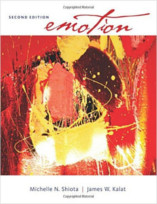

Neste episódio do Nerdologia, tentamos explicar o medo do escuro e recomendamos que você assista durante o dia.

Livros
=====

**Título**: [Emotion](http://www.amazon.com/Emotion-James-W-Kalat/dp/0495912883) 
**Autores**: [James Kalat](http://psychology.chass.ncsu.edu/faculty_staff/jwkalat.php) e [Michele Shiota](https://psychology.clas.asu.edu/faculty/michelle-shiota)

Artigos
=====

- Hsee, Christopher K., Yanping Tu, Zoe Y. Lu, and Bowen Ruan. "[**Approach aversion: Negative hedonic reactions toward approaching stimuli**](http://faculty.chicagobooth.edu/christopher.hsee/vita/Papers/Approach%20Aversion.pdf)" Journal of personality and social psychology 106, no. 5 (2014): 699.

Vídeo
=====

<iframe width="560" height="315" src="https://www.youtube.com/embed/pyJnl2lw4pU" frameborder="0" allowfullscreen></iframe>

