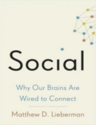

Neste episódio do Nerdologia, mostramos que as empresas não são nossas amigas, mas gostariam de ser!

Livros
=====

**Título**: [Social: Why Our Brains Are Wired to Connect](http://www.amazon.com.br/Social-Why-Brains-Wired-Connect/dp/0307889106) 
**Autor**: [Matthew D. Lieberman](http://www.scn.ucla.edu/people/lieberman.html)

**Título**: [Previsivelmente Irracional](http://www.livrariacultura.com.br/p/previsivelmente-irracional-2399440?id_link=8787&adtype=pla&gclid=CjwKEAjwhJmwBRDGsamBu8Pp7FwSJACKD1KHZPecEG9qDbQ4ttxwM0HF55lCyDS9nhTvFl-yjgbB8xoCSGrw_wcB) 
**Autor**: [Dan Ariely](http://danariely.com/)

Artigos
=====

- Rilling, James K., David A. Gutman, Thorsten R. Zeh, Giuseppe Pagnoni, Gregory S. Berns, and Clinton D. Kilts. "[**A neural basis for social cooperation**](http://www-psych.stanford.edu/~knutson/bad/rilling02.pdf)" Neuron 35, no. 2 (2002): 395-405.

- Heyman, James, and Dan Ariely. "[**Effort for payment a tale of two markets**](http://people.duke.edu/~dandan/Papers/PI/2markets.pdf)" Psychological science 15, no. 11 (2004): 787-793.

Vídeo
=====

<iframe width="560" height="315" src="https://www.youtube.com/embed/WzYXU2b_6cM" frameborder="0" allowfullscreen></iframe>

