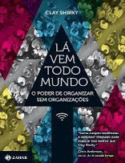

Neste episódio do Nerdologia, mostramos o poder do coletivo.

Livros
=====

**Título**: [A Sabedoria das Multidões](http://www.livrariacultura.com.br/p/a-sabedoria-das-multidoes-1234425) 
**Autor**: [James Surowiecki](http://www.newyorker.com/contributors/james-surowiecki)

**Título**: [O Poder das Conexões: a Importância do Networking e Como Ele Molda Nossas Vidas](http://www.casasbahia.com.br/livros/AdministracaoNegocios/livroAdministracao/O-Poder-das-Conexoes-a-Importancia-do-Networking-e-Como-Ele-Molda-Nossas-Vidas-117402.html) 
**Autores**: [Nicholas A. Christakis](http://nicholaschristakis.net/) e [James Fowler](http://fowler.ucsd.edu/)

**Título**: [Lá Vem Todo Mundo](https://www.google.com.br/search?q=L%C3%A1+Vem+Todo+Mundo&ie=utf-8&oe=utf-8&gws_rd=cr&ei=A7kGVqu4DIKCwgSr-obQDQ#q=L%C3%A1+Vem+Todo+Mundo&tbm=shop) 
**Autor**: [James Surowiecki](http://www.shirky.com/)

Artigos
=====

- Galton, Francis. "[**Vox populi (the wisdom of crowds)**](http://www.all-about-psychology.com/support-files/the-wisdom-of-crowds.pdf)" Nature 75 (1907): 450-451.

- Johnson, Norman L., and Kerstin Dautenhahn. "[**Collective problem solving: Functionality beyond the individual**](http://citeseerx.ist.psu.edu/viewdoc/download?doi=10.1.1.81.2636&rep=rep1&type=pdf)" Los Alamos National Laboratory technical report: LA-UR-98-2227 (1998).

- Li, Lixiang, Haipeng Peng, Jürgen Kurths, Yixian Yang, and Hans Joachim Schellnhuber. "[**Chaos–order transition in foraging behavior of ants**](https://www.pik-potsdam.de/members/.../PNAS2014Li1407083111.pdf)" Proceedings of the National Academy of Sciences 111, no. 23 (2014): 8392-8397.

- Giles, Jim. "[**Internet encyclopaedias go head to head**](http://ltc-ead.nutes.ufrj.br/constructore/objetos/news.pdf)" Nature 438, no. 7070 (2005): 900-901.

- Khatib, Firas, Frank DiMaio, Seth Cooper, Maciej Kazmierczyk, Miroslaw Gilski, Szymon Krzywda, Helena Zabranska et al. "[**Crystal structure of a monomeric retroviral protease solved by protein folding game players**](https://homes.cs.washington.edu/~zoran/NSMBfoldit-2011.pdf)" Nature structural & molecular biology 18, no. 10 (2011): 1175-1177.

- Lintott, Chris, Kevin Schawinski, Steven Bamford, Anže Slosar, Kate Land, Daniel Thomas, Edd Edmondson et al. "[**Galaxy Zoo 1: data release of morphological classifications for nearly 900 000 galaxies**](http://arxiv.org/pdf/1007.3265v4.pdf)" Monthly Notices of the Royal Astronomical Society 410, no. 1 (2011): 166-178.

Vídeo
=====

<iframe width="560" height="315" src="https://www.youtube.com/embed/eANH5f1ul7s" frameborder="0" allowfullscreen></iframe>

