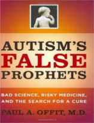
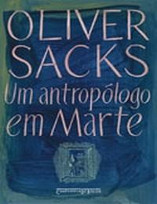

Neste episódio do Nerdologia, vamos entender o que é o autismo.

Livros
=====

**Título**: [Autism's False Prophets](http://www.livrariacultura.com.br/p/autisms-false-prophets-2467312?id_link=8787&adtype=pla&gclid=CjwKEAjwhJmwBRDGsamBu8Pp7FwSJACKD1KHmRR-nJH5IYGZqxyTJprdt8CG_zzEB6rn1mgLNi-KWRoCCAHw_wcB) 
**Autor**: [Paull Offit](http://paul-offit.com)

**Título**: [Um Antropólogo em Marte](https://www.google.com.br/search?q=Um+Antrop%C3%B3logo+em+Marte&ie=utf-8&oe=utf-8&gws_rd=cr&ei=EbMGVtGzB4L_wQSPoJGwCw#q=Um+Antrop%C3%B3logo+em+Marte&tbm=shop) 
**Autor**: [Oliver Sacks](http://www.oliversacks.com/)

Artigos
=====

- Tang, Guomei, Kathryn Gudsnuk, Sheng-Han Kuo, Marisa L. Cotrina, Gorazd Rosoklija, Alexander Sosunov, Mark S. Sonders et al. "[**Loss of mTOR-dependent macroautophagy causes autistic-like synaptic pruning deficits**](http://ac.els-cdn.com/S0896627314006515/1-s2.0-S0896627314006515-main.pdf?_tid=1a4ebcb6-6460-11e5-ba26-00000aab0f6c&acdnat=1443280142_5b60019e9d937537c2b0abb49d9d259e)" Neuron 83, no. 5 (2014): 1131-1143.

- Howlin, Patricia, Susan Goode, Jane Hutton, and Michael Rutter. "[**Savant skills in autism: psychometric approaches and parental reports**](http://rstb.royalsocietypublishing.org/content/royptb/364/1522/1359.full.pdf)" Philosophical Transactions of the Royal Society B: Biological Sciences 364, no. 1522 (2009): 1359-1367.

- Foxx, Richard M. "[**Applied behavior analysis treatment of autism: The state of the art**](http://mouse.he.net/~hbft/uploadResources/Foxx.2008.Applied.behavior.analysis.with.autism.pdf)" Child and adolescent psychiatric clinics of North America 17, no. 4 (2008): 821-834.

Vídeo
=====

<iframe width="560" height="315" src="https://www.youtube.com/embed/vJx1w7fCDm0" frameborder="0" allowfullscreen></iframe>

