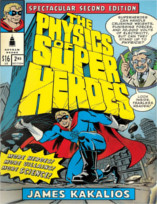

Neste episódio do Nerdologia, vamos entender como funcionariam os poderes da Lince Negra.

Livros
=====

**Título**: [The Physics of Superheroes](https://www.google.com.br/search?output=search&tbm=shop&q=The+Physics+of+Superheroes%2C+pelo+James+Kakalios&oq=The+Physics+of+Superheroes%2C+pelo+James+Kakalios&gs_l=products-cc.3...1143.1143.0.1779.1.1.0.0.0.0.192.192.0j1.1.0....0...1ac.1.64.products-cc..1.0.0.uMn0a5R3Y4I#tbm=shop&q=The+Physics+of+Superheroes) 
**Autor**: [James Kakalios](https://www.physics.umn.edu/people/kakalios.html)

Artigos
=====

- Tadokoro, M. "A Study of the Local Group by Use of the Virial Theorem." Publications of the Astronomical Society of Japan 20 (1968): 230.
-Zwicky, Fritz. "[**On the Masses of Nebulae and of Clusters of Nebulae.**](http://articles.adsabs.harvard.edu/cgi-bin/nph-iarticle_query?1968PASJ...20..230T&defaultprint=YES&page_ind=0&filetype=.pdf)" The Astrophysical Journal 86 (1937): 217.

Vídeo
=====

<iframe width="560" height="315" src="https://www.youtube.com/embed/EkyRnJgHQhI" frameborder="0" allowfullscreen></iframe>

