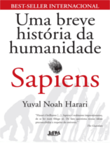
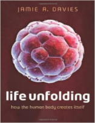

Centésimo nerdologia falando sobre o que somos nós e o paradoxo de Teseu.

Livros
=====

**Título**: [Uma Breve História da Humanidade - Sapiens](http://www.livrariacultura.com.br/p/life-unfolding-42190543?id_link=8787) 
**Autor**: [Yuval Noah Harari](http://www.ynharari.com/)

**Título**: [Life Unfolding: How the Human Body Creates Itself](https://www.google.com.br/search?output=search&tbm=shop&q=Uma+Breve+Hist%C3%B3ria+da+Humanidade+-+Sapiens&oq=Uma+Breve+Hist%C3%B3ria+da+Humanidade+-+Sapiens&gs_l=products-cc.3...3746.3746.0.4446.1.1.0.0.0.0.163.163.0j1.1.0....0...1ac.1.64.products-cc..1.0.0.sCazhU1Fftc) 
**Autor**: [Jamie A. Davies](http://www.ed.ac.uk/integrative-physiology/staff-profiles/research-groups/jamie-davies)

Artigos
=====

- Bianconi, Eva, Allison Piovesan, Federica Facchin, Alina Beraudi, Raffaella Casadei, Flavia Frabetti, Lorenza Vitale et al. "[**An estimation of the number of cells in the human body**](http://nanoimmondizia.ge.ibf.cnr.it/UserFiles/documenti/Bianconi_AHB_2013.pdf)" Annals of human biology 40, no. 6 (2013): 463-471.

- Spalding, Kirsty L., Ratan D. Bhardwaj, Bruce A. Buchholz, Henrik Druid, and Jonas Frisén. "[**Retrospective birth dating of cells in humans**](http://ac.els-cdn.com/S0092867405004083/1-s2.0-S0092867405004083-main.pdf?_tid=e6dbc684-6406-11e5-8945-00000aacb35e&acdnat=1443241831_2417c025e5ff9b4950a41c50147955a4)" Cell 122, no. 1 (2005): 133-143. 

Vídeo
=====

<iframe width="560" height="315" src="https://www.youtube.com/embed/-HCHKLky7U8" frameborder="0" allowfullscreen></iframe>

