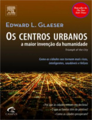

Neste episódio do Nerdologia, vamos entender qual seria a maior perda durante a ruína da humanidade.

Livros
=====

**Título**: [O Otimista Racional](http://www.saraiva.com.br/o-otimista-racional-por-que-o-mundo-melhora-7276787.html) 
**Autor**: [Matt Ridley](http://www.mattridley.co.uk/)

**Título**: [Os Centros Urbanos: a maior invenção da humanidade](http://www.livrariacultura.com.br/p/centros-urbanos-os-a-maior-invencao-da-22527581) 
**Autor**: [Edward Glaeser](http://scholar.harvard.edu/glaeser/home)

Artigos
=====

- Read, Leonard E. "[**I, pencil**](http://www.econlib.org/library/Essays/rdPncl1.html)". (1958): 32-37.

- Flynn, James R. "[**Massive IQ gains in 14 nations: What IQ tests really measure**](http://www.jugendsozialarbeit.de/media/raw/flynn1987_What_IQ_tests_really_measure.pdf)". Psychological bulletin 101, no. 2 (1987): 171.

Vídeo
=====

<iframe width="560" height="315" src="https://www.youtube.com/embed/4_TU5fI-zdQ" frameborder="0" allowfullscreen></iframe>

