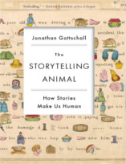
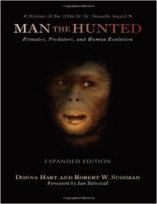

Neste episódio do Nerdologia, vamos entender de onde vêm o nosso gosto por terror!

Livros
=====

**Título**: [The Storytelling Animal: How Stories Make Us Human](http://www.amazon.com.br/The-Storytelling-Animal-Stories-Human/dp/0544002342) 
**Autor**: [Jonathan Gottschall](http://jonathangottschall.com/)

**Título**: [Man the Hunted: Primates, Predators, and Human Evolution](http://www.amazon.com/Man-Hunted-Primates-Predators-Evolution/dp/0813344034) 
**Autor**: [Donna Hart](http://www.goodreads.com/author/show/488042.Donna_Hart) e [Robert Wald Sussman](https://anthropology.artsci.wustl.edu/sussman_robert
)

Artigos
=====

- Kano, Fumihiro, and Satoshi Hirata. "[**Great apes make anticipatory looks based on long-term memory of single events**](http://www.sciencedirect.com/science/article/pii/S096098221500946X)". Current Biology 25, no. 19 (2015): 2513-2517.

- Zald, David H., Ronald L. Cowan, Patrizia Riccardi, Ronald M. Baldwin, M. Sib Ansari, Rui Li, Evan S. Shelby, Clarence E. Smith, Maureen McHugo, and Robert M. Kessler. "[**Midbrain dopamine receptor availability is inversely associated with novelty-seeking traits in humans**](http://www.jneurosci.org/content/28/53/14372.full.pdf+html)". The Journal of Neuroscience 28, no. 53 (2008): 14372-14378.

- Blumstein, Daniel T., Richard Davitian, and Peter D. Kaye. "[**Do film soundtracks contain nonlinear analogues to influence emotion?**](http://rsbl.royalsocietypublishing.org/content/early/2010/05/20/rsbl.2010.0333)". Biology letters 6, no. 6 (2010): 751-754.

Vídeo
=====

<iframe width="560" height="315" src="https://www.youtube.com/embed/TtUejyNHZbc" frameborder="0" allowfullscreen></iframe>

