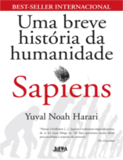
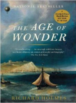

Faça-se a luz! Neste episódio do Nerdologia, hoje nós vamos ver qual a parte que a humanidade tem nisso.

Livros
=====

**Título**: [Uma Breve História da Humanidade - Sapiens](http://www.livrariacultura.com.br/p/life-unfolding-42190543?id_link=8787) 
**Autor**: [Yuval Noah Harari](http://www.ynharari.com/)

**Título**: [The Age of Wonder](http://www.amazon.com/The-Age-Wonder-Generation-Discovery/dp/1400031877) 
**Autor**: [Richard Holmes](literature.britishcouncil.org/richard-holmes)

**Título**: [The Age of Edison: Electric Light and the Invention of Modern America](http://www.amazon.com/The-Age-Edison-Electric-Invention/dp/0143124447) 
**Autor**: [Ernest Freeberg](http://www.history.utk.edu/peopletwo/ernest-freeberg/
)

Artigos
=====

- Saha, Sonali. "[**Patterns in woody species diversity, richness and partitioning of diversity in forest communities of tropical deciduous forest biome**](http://onlinelibrary.wiley.com/doi/10.1034/j.1600-0587.2003.03411.x/abstract?systemMessage=Wiley+Online+Library+will+be+unavailable+on+Saturday+7th+November+2015++from+10%3A00-16%3A00+GMT+%2F+05%3A00-11%3A00+EST+%2F+18%3A00-00%3A00+SGT+for+essential+maintenance.++Apologies+for+the+inconvenience.)". Ecography 26, no. 1 (2003): 80-86.

- Zheludev, Nikolay. "[**The life and times of the LED—a 100-year history**](https://www.kva.se/globalassets/priser/nobel/2014/nobelposterphysics2014_high.pdf)". Nature Photonics 1, no. 4 (2007): 189-192.

Vídeo
=====

<iframe width="560" height="315" src="https://www.youtube.com/embed/YabTFq2aZfE" frameborder="0" allowfullscreen></iframe>

