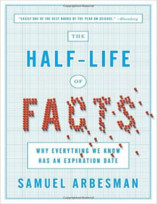
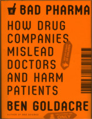

Neste episódio do Nerdologia vamos ver para que serve a fosfoetanolamina.

Livros
=====

**Título**: [The Half-Life of Facts: Why Everything We Know Has an Expiration Date](http://www.amazon.com/The-Half-Life-Facts-Everything-Expiration/dp/159184651X) 
**Autor**: [Samuel Asberman](http://www.arbesman.net/)

**Título**: [Bad Pharma: How Drug Companies Mislead Doctors and Harm Patients](http://www.amazon.com/Bad-Pharma-Companies-Mislead-Patients/dp/0865478007) 
**Autor**: [Ben Goldacre](http:/www.badscience.net/about-dr-ben-goldacre/)

Vídeo
=====

<iframe width="560" height="315" src="https://www.youtube.com/embed/RM77fAQpeTQ" frameborder="0" allowfullscreen></iframe>

