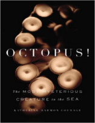

Neste episódio do Nerdologia, vamos saber um pouco mais sobre a vida real do Lula Molusco!

Livros
=====

**Título**: [Octopus!: The Most Mysterious Creature in the Sea](http://www.amazon.com/Octopus-The-Most-Mysterious-Creature/dp/1591845270) 
**Autor**: [Katherine Harmon Courage](http://www.katherinecourage.com)

**Título**: [Soul of an Octopus](http://www.amazon.com.br/The-Soul-Octopus-Exploration-Consciousness/dp/1451697716) 
**Autor**: [Sy Montgomery](http://www.symontgomery.com/)

Artigos
=====

- Herculano-Houzel, Suzana. "[**The human brain in numbers: a linearly scaled-up primate brain**](http://www.ncbi.nlm.nih.gov/pubmed/19915731)". Frontiers in human neuroscience 3 (2009).

- Finn, Julian K., Tom Tregenza, and Mark D. Norman. "[**Defensive tool use in a coconut-carrying octopus**](http://www.cell.com/current-biology/abstract/S0960-9822(09)01914-9?_returnURL=http%3A%2F%2Flinkinghub.elsevier.com%2Fretrieve%2Fpii%2FS0960982209019149%3Fshowall%3Dtrue&cc=y=)". Current Biology 19, no. 23 (2009): R1069-R1070.

- Chiao, Chuan-Chin, J. Kenneth Wickiser, Justine J. Allen, Brock Genter, and Roger T. Hanlon. "[**Hyperspectral imaging of cuttlefish camouflage indicates good color match in the eyes of fish predators**](http://www.ncbi.nlm.nih.gov/pubmed/21576487)". Proceedings of the National Academy of Sciences 108, no. 22 (2011): 9148-9153.

- Marian, José Eduardo AR, Yukihiro Shiraki, Kumi Kawai, Sawako Kojima, Yasuhiko Suzuki, and Kenzo Ono. "[**Revisiting a medical case of "stinging" in the human oral cavity caused by ingestion of raw squid (Cephalopoda: Teuthida): new data on the functioning of squid’s spermatophores**](http://link.springer.com/article/10.1007%2Fs00435-012-0165-0)". Zoomorphology 131, no. 4 (2012): 293-301.

Vídeo
=====

<iframe width="560" height="315" src="https://www.youtube.com/embed/lrdQDLEQFMc" frameborder="0" allowfullscreen></iframe>

