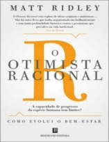
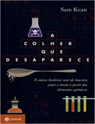

Neste episódio do Nerdologia vamos entender a diferença que a energia fez para a humanidade.

Livros
=====

**Título**: [O Otimista Racional](http://www.saraiva.com.br/o-otimista-racional-por-que-o-mundo-melhora-7276787.html) 
**Autor**: [Matt Ridley](http://www.mattridley.co.uk/)

**Título**: [Second Machine Age](http://www.amazon.com.br/gp/product/8576089149/ref=as_li_tl?ie=UTF8&camp=1789&creative=9325&creativeASIN=8576089149&linkCode=as2&tag=nerdologia-20&linkId=WMADE5TFLZKZ4RBD) 
**Autor**: [Andrew McAfee](http://andrewmcafee.org/blog/) e [Erik Brynjolfsson](http://www.ebusiness.mit.edu/erik/)

**Título**: [A Colher que Desaparece](http://www.amazon.com.br/gp/product/8537806935/ref=as_li_qf_sp_asin_il_tl?ie=UTF8&camp=1789&creative=9325&creativeASIN=8537806935&linkCode=as2&tag=nerdologia-20) 
**Autor**: [Sam Kean](http://www.samkean.com/)

Artigos
=====

- Gerald A. Meehl, Claudia Tebaldi, Guy Walton, David Easterling, Larry McDaniel. "[**Relative increase of record high maximum temperatures compared to record low minimum temperatures in the U.S.**](http://onlinelibrary.wiley.com/doi/10.1029/2009GL040736/full)". Geophysical Research Letters, Volume 36, Issue 23 December 2009.

- Coumou, Dim, and Stefan Rahmstorf. "[**A decade of weather extremes**](http://www.nature.com/nclimate/journal/v2/n7/full/nclimate1452.html)". Nature Climate Change 2, no. 7 (2012): 491-496.

- Rahmstorf, Stefan, and Dim Coumou. "[**Increase of extreme events in a warming world**](http://www.pnas.org/content/108/44/17905.abstract)". Proceedings of the National Academy of Sciences 108, no. 44 (2011): 17905-17909.

Vídeo
=====

<iframe width="560" height="315" src="https://www.youtube.com/embed/pXtVUobPQLs" frameborder="0" allowfullscreen></iframe>

