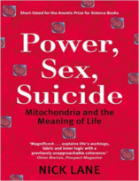

No Nerdologia de hoje, vamos ver quais forças são necessárias para explicar A Força

Livros
=====

**Título**: [Power, Sex, Suicide: Mitochondria and the meaning of life](http://www.amazon.com.br/gp/product/B006QV7ZGO) 
**Autor**: [Nick Lane](http://www.nick-lane.net/)

Artigos
=====

- Englert, François; Brout, Robert (1964). ["Broken Symmetry and the Mass of Gauge Vector Mesons"](http://journals.aps.org/prl/abstract/10.1103/PhysRevLett.13.321). Physical Review Letters 13 (9): 321–23. Bibcode:1964PhRvL..13..321E. doi:10.1103/PhysRevLett.13.321.

- Higgs, Peter (1964). ["Broken Symmetries and the Masses of Gauge Bosons"](https://journals.aps.org/prl/pdf/10.1103/PhysRevLett.13.508). Physical Review Letters 13 (16): 508–509. Bibcode:1964PhRvL..13..508H. doi:10.1103/PhysRevLett.13.508.

- Guralnik, Gerald; Hagen, C. R.; Kibble, T. W. B. (1964). ["Global Conservation Laws and Massless Particles"](http://journals.aps.org/prl/abstract/10.1103/PhysRevLett.13.585). Physical Review Letters 13 (20): 585–587. Bibcode:1964PhRvL..13..585G. doi:10.1103/PhysRevLett.13.585.

Vídeo
=====

<iframe width="560" height="315" src="https://www.youtube.com/embed/eKNxhebmGzI" frameborder="0" allowfullscreen></iframe>

