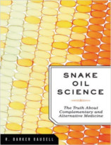
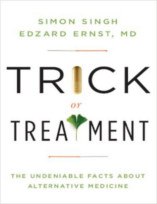

No Nerdologia de hoje, vamos entender como funcionam terapias como a homeopatia.

Livros
=====

**Título**: [Previsivelmente Irracional](http://www.livrariacultura.com.br/p/previsivelmente-irracional-2399440?id_link=8787&adtype=pla&gclid=CjwKEAjwhJmwBRDGsamBu8Pp7FwSJACKD1KHZPecEG9qDbQ4ttxwM0HF55lCyDS9nhTvFl-yjgbB8xoCSGrw_wcB) 
**Autor**: [Dan Ariely](http://danariely.com/)

**Título**: [Snake Oil Science: The Truth about Complementary and Alternative Medicine](http://www.amazon.com.br/gp/product/B003ULNSAU) 
**Autor**: [R. Barker Bausell](https://www.psychologytoday.com/experts/r-barker-bausell-phd)

**Título**: [Trick or Treatment: The Undeniable Facts about Alternative Medicine](http://www.amazon.com.br/gp/product/B001CDZZHW) 
**Autores**: [Edzard Ernst](http://edzardernst.com/) e [Simon Singh](http://simonsingh.net/)

Artigos
=====

- Beecher, Henry K. ["The powerful placebo."](http://jgh.ca/uploads/Psychiatry/Links/beecher.pdf) Journal of the American Medical Association 159, no. 17 (1955): 1602-1606.

- Hróbjartsson, Asbjørn, and Peter C. Gøtzsche. ["Is the placebo powerless? An analysis of clinical trials comparing placebo with no treatment."](http://www.nejm.org/doi/full/10.1056/NEJM200105243442106) New England Journal of Medicine 344, no. 21 (2001): 1594-1602.

- Tuttle, Alexander H., Sarasa Tohyama, Tim Ramsay, Jonathan Kimmelman, Petra Schweinhardt, Gary J. Bennett, and Jeffrey S. Mogil. ["Increasing placebo responses over time in US clinical trials of neuropathic pain."](https://www.metajournal.com/articles/129514/increasing-placebo-responses-time-u-s-clinical-trials-neuropathic-pain) Pain 156, no. 12 (2015): 2616-2626.

- Davenas, E., F. Beauvais, J. Amara, M. Oberbaum, B. Robinzon, A. Miadonnai, A. Tedeschi et al. ["Human basophil degranulation triggered by very dilute antiserum against IgE."](http://www.ncbi.nlm.nih.gov/pubmed/2455231) Nature 333, no. 6176 (1988): 30.

- Maddox, John, James Randi, and Walter W. Stewart. ["'High-dilution' experiments a delusion."](http://www.badscience.net/wp-content/uploads/benveniste02.pdf) Nature 334, no. 6180 (1988): 287.

Vídeo
=====

<iframe width="560" height="315" src="https://www.youtube.com/embed/26AgMFsh-98" frameborder="0" allowfullscreen></iframe>

