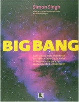

No Nerdologia de hoje, vamos ver o que são as ondas gravitacionais e do que importa observá-las.

Livros
=====

**Título**: [Big Bang](https://www.amazon.com.br/Big-Bang-Simon-Singh/dp/8501072133) 
**Autor**: [Simon Singh](http://www.simonsingh.net/)

Artigos
=====

- Jansky, Karlk Guthe. ["Radio waves from outside the solar system."](http://www.nature.com/nature/journal/v132/n3323/abs/132066a0.html) Nature 132, no. 3323 (1933): 66-66.

- B. P. Abbott et al. (LIGO Scientific Collaboration and Virgo Collaboration). ["Observation of Gravitational Waves from a Binary Black Hole Merger"](https://physics.aps.org/featured-article-pdf/10.1103/PhysRevLett.116.061102) Phys. Rev. Lett. 116, 061102 (2016).

Vídeo
=====

<iframe width="560" height="315" src="https://www.youtube.com/embed/z71O5cHTOvM" frameborder="0" allowfullscreen></iframe>

