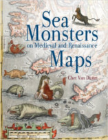

No Nerdologia de hoje, vamos nos perguntar onde estão os alienígenas e criaturas bizarras.

Livros
=====

**Título**: [Sea Monsters on Medieval and Renaissance Maps](https://www.amazon.com.br/Sea-Monsters-Medieval-Renaissance-Maps/dp/0712357718) 
**Autor**: [Chet Van Duzer](http://independent.academia.edu/ChetVanDuzer)

Artigos
=====

- Popova, Olga P., Peter Jenniskens, Vacheslav Emel’yanenko, Anna Kartashova, Eugeny Biryukov, Sergey Khaibrakhmanov, Valery Shuvalov et al. ["Chelyabinsk airburst, damage assessment, meteorite recovery, and characterization."](http://science.sciencemag.org/content/342/6162/1069) Science 342, no. 6162 (2013): 1069-1073.

- Brown, P. G., J. D. Assink, L. Astiz, R. Blaauw, M. B. Boslough, J. Borovička, N. Brachet et al. ["A 500-kiloton airburst over Chelyabinsk and an enhanced hazard from small impactors."](http://www.nature.com/nature/journal/v503/n7475/full/nature12741.html) Nature 503, no. 7475 (2013): 238-241.

- Borovička, Jiří, Pavel Spurný, Peter Brown, Paul Wiegert, Pavel Kalenda, David Clark, and Lukáš Shrbený. ["The trajectory, structure and origin of the Chelyabinsk asteroidal impactor."](http://www.astronom.cz/borovicka/Borovickaetal_Chelyabinsk_accepted.pdf) Nature 503, no. 7475 (2013): 235-237.

- Davies, Tim K., Guy Stevens, Mark G. Meekan, Juliane Struve, and J. Marcus Rowcliffe. ["Can citizen science monitor whale-shark aggregations? Investigating bias in mark–recapture modelling using identification photographs sourced from the public."](https://www.researchgate.net/publication/273620902_Can_citizen_science_monitor_whale-shark_aggregations_Investigating_bias_in_markrecapture_modelling_using_identification_photographs_sourced_from_the_public) Wildlife Research 39, no. 8 (2013): 696-704.

Vídeo
=====

<iframe width="560" height="315" src="https://www.youtube.com/embed/KRuUPNb-11s" frameborder="0" allowfullscreen></iframe>

