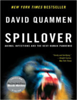

No Nerdologia de hoje, vamos ver qual a pandemia que poderia acabar com a humanidade – ou quase!

Livros
=====

**Título**: [Biohazard](http://www.amazon.com.br/gp/product/B0031RS5DI) 
**Autor**: [Ken Alibek](https://en.wikipedia.org/wiki/Ken_Alibek)

**Título**: [Spillover: Animal Infections and the Next Human Pandemic](http://www.amazon.com.br/gp/product/B00856PC4K) 
**Autor**: [David Quammen](http://www.davidquammen.com/)

Artigos
=====

- Nicolau Barquet, & Pere Domingo (1997). ["Smallpox: The Triumph over the Most Terrible of the Ministers of Death Ann Intern Med"](http://annals.org/article.aspx?articleid=710873), 127 (8), 635-642

- Wolfe, N., Dunavan, C., & Diamond, J. (2007). ["Origins of major human infectious diseases Nature"](http://www.nature.com/nature/journal/v447/n7142/full/nature05775.html), 447 (7142), 279-283 DOI: 10.1038/nature05775

- Goulart, A. da C. (2005). Revisitando a espanhola: a gripe pandêmica de 1918 no Rio de Janeiro; ["Revisiting the Spanish flu: the 1918 influenza pandemic in Rio de Janeiro."](http://www.ncbi.nlm.nih.gov/pubmed/16116711) História, Ciências, Saúde-Manguinhos, 12(1), 101–142. SciELO.

- Souza, C. M. C. de. (2005). ["As dimensões político-sociais de uma epidemia: a paulicéia desvairada pela gripe espanhola; The sociopolitical dimensions of an epidemic: São Paulo in the mad grip of the Spanish flu."](http://www.scielo.br/scielo.php?script=sci_arttext&pid=S0104-59702005000200023) História, Ciências, Saúde-Manguinhos, 12(2), 567-574. SciELO.

Vídeo
=====

<iframe width="560" height="315" src="https://www.youtube.com/embed/r9r_VwoZvho" frameborder="0" allowfullscreen></iframe>

