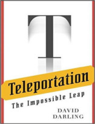

No Nerdologia de hoje, vamos ver como seria possível ser teletransportado de um lugar para outro!

Livros
=====

**Título**: [Teleportation: The Impossible Leap](http://www.amazon.com.br/gp/product/B00DNL0S1E) 
**Autor**: [David Darling](https://www.daviddarling.info/me.html)

Artigos
=====

- Glasstone, Samuel; Dolan, Philip J. (1977). ["The Effects of Nuclear Weapons"](http://www.deepspace.ucsb.edu/wp-content/uploads/2013/01/Effects-of-Nuclear-Weapons-1977-3rd-edition-complete.pdf), Third Edition. United States: United States Department of Defense and United States Department of Energy.

- Bennett, Charles H., Gilles Brassard, Claude Crépeau, Richard Jozsa, Asher Peres, and William K. Wootters. ["Teleporting an unknown quantum state via dual classical and Einstein-Podolsky-Rosen channels."](http://journals.aps.org/prl/abstract/10.1103/PhysRevLett.70.1895) Physical review letters 70, no. 13 (1993): 1895.

- Einstein, Albert, Boris Podolsky, and Nathan Rosen. ["Can quantum-mechanical description of physical reality be considered complete?."](http://www.drchinese.com/David/EPR.pdf) Physical review 47, no. 10 (1935): 777.

- Lemos, Gabriela Barreto, Victoria Borish, Garrett D. Cole, Sven Ramelow, Radek Lapkiewicz, and Anton Zeilinger. ["Quantum imaging with undetected photons."](http://arxiv.org/pdf/1401.4318.pdf) Nature 512, no. 7515 (2014): 409-412.

- Yin, Juan, Ji-Gang Ren, He Lu, Yuan Cao, Hai-Lin Yong, Yu-Ping Wu, Chang Liu et al. ["Quantum teleportation and entanglement distribution over 100-kilometre free-space channels."](http://www.nature.com/nature/journal/v488/n7410/full/nature11332.html) Nature 488, no. 7410 (2012): 185-188.

- Sender, Ron, Shai Fuchs, and Ron Milo. ["Are we really vastly outnumbered? Revisiting the ratio of bacterial to host cells in humans."](http://www.ncbi.nlm.nih.gov/pubmed/26824647) Cell 164, no. 3 (2016): 337-340.

Vídeo
=====

<iframe width="560" height="315" src="https://www.youtube.com/embed/JzpgTd2FOss" frameborder="0" allowfullscreen></iframe>

