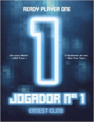

No Nerdologia de hoje, vamos saber mais sobre porque estamos entrando na era da realidade virtual ou VR!

Livros
=====

**Título**: [O Poder das Conexões: a Importância do Networking e Como Ele Molda Nossas Vidas](http://www.casasbahia.com.br/livros/AdministracaoNegocios/livroAdministracao/O-Poder-das-Conexoes-a-Importancia-do-Networking-e-Como-Ele-Molda-Nossas-Vidas-117402.html) 
**Autores**: [Nicholas A. Christakis](http://nicholaschristakis.net/) e [James Fowler](http://fowler.ucsd.edu/)

**Título**: [Jogador número 1](http://www.amazon.com.br/gp/product/B00A3C44BQ) 
**Autor**: [Ernest Cline](https://www.ernestcline.com/)

Artigos
=====

- Laver, K., S. George, S. Thomas, J. E. Deutsch, and M. Crotty. ["Cochrane review: virtual reality for stroke rehabilitation."](http://www.ncbi.nlm.nih.gov/pubmed/22713539) European journal of physical and rehabilitation medicine 48, no. 3 (2012): 523-530.

- Levin, Mindy F. ["Can virtual reality offer enriched environments for rehabilitation?."](http://www.ncbi.nlm.nih.gov/pubmed/21306202) Expert review of neurotherapeutics (2014).

- Yee, Nick, and Jeremy Bailenson. ["The Proteus effect: The effect of transformed self‐representation on behavior."](https://vhil.stanford.edu/mm/2007/yee-proteus-effect.pdf) Human communication research 33, no. 3 (2007): 271-290.

Vídeo
=====

<iframe width="560" height="315" src="https://www.youtube.com/embed/FuuirfHFG2M" frameborder="0" allowfullscreen></iframe>

