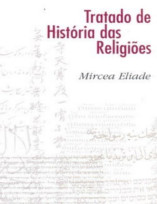

No Nerdologia de hoje, veremos interpretações do que pode ser o Apocalipse, além do primeiro mutante que existiu, claro.

Livros
=====

**Título**: [O fim da Terra e do Céu](http://www.livrariacultura.com.br/p/o-fim-da-terra-e-do-ceu-29183545) 
**Autor**: [Marcelo Gleiser](http://www.marcelogleiser.com/)

**Título**: [Tratado de História das Religiões](http://www.saraiva.com.br/tratado-de-historia-das-religioes-4-ed-3065129.html) 
**Autor**: [Mircea Eliade](http://www.westminster.edu/staff/brennie/eliade/mebio.htm)

**Título**: [Islam: A Very Short Introduction](http://www.amazon.com/Islam-Short-Introduction-Malise-Ruthven/dp/0199642877) 
**Autor**: [Malise Ruthven](https://en.wikipedia.org/wiki/Malise_Ruthven)

**Título**: [O Terceiro Templo: Os conflitos árabe-israelenses e os choques do petróleo](http://www.objetiva.com.br/livro_ficha.php?id=1548) 
**Autor**: [Ivan Sant´Anna](https://pt.wikipedia.org/wiki/Ivan_Sant%27anna)

Vídeo
=====

<iframe width="560" height="315" src="https://www.youtube.com/embed/Mn16Ugn5W2s" frameborder="0" allowfullscreen></iframe>

